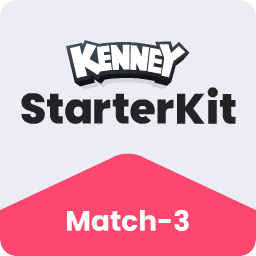
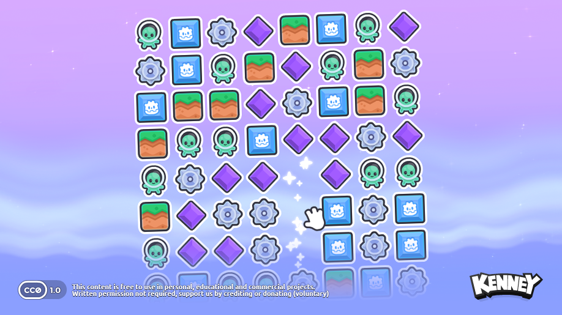

# Starter Kit Match-3

This package includes a basic template for a match-3 game in Godot 4.6. Includes features like;

- Easy to understand code
- Effects like animations, sounds and particles
- Custom cursors
- 2D Sprites _(CC0 licensed)_

### Screenshot

### Controls

| Key | Command |
| --- | --- |
| <kbd>Left mouse</kbd> | Click & drag tile to swap |

### Instructions

#### 1. How to adjust the board size?

Select the 'Main' node and in the properties section adjust the width and height

#### 2. How to add more tiles or adjust the visuals?

Select the 'Main' node and in the tiles section change the visuals

### License

MIT License

Copyright (c) 2026 Kenney

Permission is hereby granted, free of charge, to any person obtaining a copy of this software and associated documentation files (the "Software"), to deal in the Software without restriction, including without limitation the rights to use, copy, modify, merge, publish, distribute, sublicense, and/or sell copies of the Software, and to permit persons to whom the Software is furnished to do so, subject to the following conditions:

The above copyright notice and this permission notice shall be included in all copies or substantial portions of the Software.

THE SOFTWARE IS PROVIDED "AS IS", WITHOUT WARRANTY OF ANY KIND, EXPRESS OR IMPLIED, INCLUDING BUT NOT LIMITED TO THE WARRANTIES OF MERCHANTABILITY, FITNESS FOR A PARTICULAR PURPOSE AND NONINFRINGEMENT. IN NO EVENT SHALL THE AUTHORS OR COPYRIGHT HOLDERS BE LIABLE FOR ANY CLAIM, DAMAGES OR OTHER LIABILITY, WHETHER IN AN ACTION OF CONTRACT, TORT OR OTHERWISE, ARISING FROM, OUT OF OR IN CONNECTION WITH THE SOFTWARE OR THE USE OR OTHER DEALINGS IN THE SOFTWARE.

Assets included in this package (2D sprites, 3D models and sound effects) are [CC0 licensed](https://creativecommons.org/publicdomain/zero/1.0/)
Small Godot logo made by Kay Lousberg (http://kaylousberg.com/)
